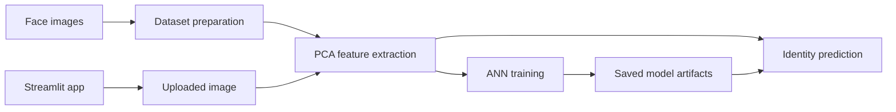

# Face Recognition PCA + ANN

This repository is a legacy project pointer. The maintained implementation, setup guide, model files, and architecture notes live in the canonical repository:

**[Open FaceRecognition-PCA-ANN](https://github.com/kalyan870/FaceRecognition-PCA-ANN)**

## Project overview

The canonical app uses PCA (eigenfaces) to reduce face-image dimensions and an artificial neural network to classify enrolled identities. It includes a Streamlit interface, dataset preparation scripts, and model artifacts.

## Architecture

The diagram summarizes the canonical project; this pointer repository does not contain the application source or models.

## Run and demo

Use the canonical repository's [README setup instructions](https://github.com/kalyan870/FaceRecognition-PCA-ANN#run-locally) and its hosted [Streamlit demo](https://appapppy-82gfkkrhjfskrpay5mtyqz.streamlit.app/). The demo may be unavailable while it starts or sleeps.

## Repository status

No code is duplicated here. Keeping one maintained implementation avoids divergent setup instructions and model files.
